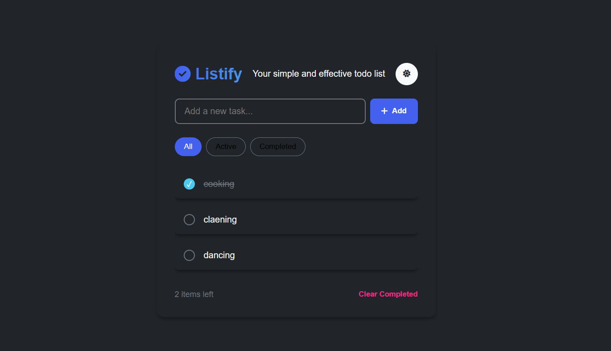

# ✅ Listify - A Simple & Stylish Todo App

*Listify* is a modern, minimal, and fully responsive Todo list web app built with HTML, CSS, and JavaScript. It includes filtering, task management, theme toggle (light/dark), and persistent storage using localStorage.

## 🚀 Live Demo

👉 [Click here to view Listify live](https://kusumalatha14.github.io/Listify)

---

## ✨ Features

- Add, edit, delete todos
- Mark tasks as completed
- Filter tasks: All | Active | Completed
- Clear completed tasks
- Task counter (items left)
- Light/Dark mode toggle
- LocalStorage support to save your list
- Responsive design for mobile and desktop

---

## 🛠 Tech Stack

- HTML5
- CSS3
- JavaScript (ES6+)
- Font Awesome (for icons)

---

## 📁 Folder Structure

Listify/
│
├── index.html          # Main HTML file
├── styles.css          # App styling
├── script.js           # App logic and interactivity
├── README.md           # This file
├── LICENSE             # Open-source license (MIT)
└── screenshot.png      # App screenshot

---

## 📦 Getting Started

You can run this project locally by following these steps:

### 1. Clone the Repository

bash
git clone https://github.com/kusumalatha14/Listify.git
cd Listify

### 2. Open in Browser

Open index.html with your preferred browser, or use Live Server in VS Code.

---

## 📜 License

This project is open-source and available under the *MIT License*.  
See the [LICENSE](LICENSE) file for more information.

---

## 📧 Contact

*Modala Kusuma Latha*  
📧 [kusumalatha0414@gmail.com](mailto:kusumalatha0414@gmail.com)  
🔗 [GitHub: kusumalatha14](https://github.com/kusumalatha14)

---

## 🙏 Acknowledgements

- Font Awesome for icons
- LocalStorage for offline persistence
- Inspiration from minimalist task managers

---

## 🌟 Show Your Support

If you like this project, feel free to ⭐ star it and share it with others!

 
👨‍💻 Created by Modala Kusuma Latha
